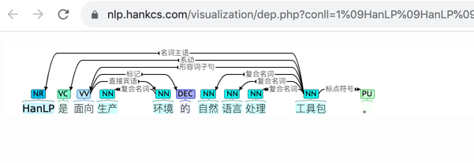

# 实现一种结构化可视化页面
> 直接复原其他已实现的前端

### 参考hanlp

- hanlp网站地址：https://hanlp.hankcs.com/demos/dep.html


- 其中一个可视化显示：
  
  ```
  请求地址：https://nlp.hankcs.com/visualization/dep.php?conll=1%09HanLP%09HanLP%09NR%09NR%09_%0910%09%E5%90%8D%E8%AF%8D%E4%B8%BB%E8%AF%AD%09_%09_%0A2%09%E6%98%AF%09%E6%98%AF%09VC%09VC%09_%0910%09%E7%B3%BB%E5%8A%A8%09_%09_%0A3%09%E9%9D%A2%E5%90%91%09%E9%9D%A2%E5%90%91%09VV%09VV%09_%0910%09%E5%BD%A2%E5%AE%B9%E8%AF%8D%E5%AD%90%E5%8F%A5%09_%09_%0A4%09%E7%94%9F%E4%BA%A7%09%E7%94%9F%E4%BA%A7%09NN%09NN%09_%095%09%E5%A4%8D%E5%90%88%E5%90%8D%E8%AF%8D%09_%09_%0A5%09%E7%8E%AF%E5%A2%83%09%E7%8E%AF%E5%A2%83%09NN%09NN%09_%093%09%E7%9B%B4%E6%8E%A5%E5%AE%BE%E8%AF%AD%09_%09_%0A6%09%E7%9A%84%09%E7%9A%84%09DEC%09DEC%09_%093%09%E6%A0%87%E8%AE%B0%09_%09_%0A7%09%E8%87%AA%E7%84%B6%09%E8%87%AA%E7%84%B6%09NN%09NN%09_%0910%09%E5%A4%8D%E5%90%88%E5%90%8D%E8%AF%8D%09_%09_%0A8%09%E8%AF%AD%E8%A8%80%09%E8%AF%AD%E8%A8%80%09NN%09NN%09_%0910%09%E5%A4%8D%E5%90%88%E5%90%8D%E8%AF%8D%09_%09_%0A9%09%E5%A4%84%E7%90%86%09%E5%A4%84%E7%90%86%09NN%09NN%09_%0910%09%E5%A4%8D%E5%90%88%E5%90%8D%E8%AF%8D%09_%09_%0A10%09%E5%B7%A5%E5%85%B7%E5%8C%85%09%E5%B7%A5%E5%85%B7%E5%8C%85%09NN%09NN%09_%090%09%E6%A0%B9%09_%09_%0A11%09%E3%80%82%09%E3%80%82%09PU%09PU%09_%0910%09%E6%A0%87%E7%82%B9%E7%AC%A6%E5%8F%B7%09_%09_%0A&download=0
  ```
- 下载该页面静态页面及依赖的js、css存放本地，包含如下（见exercise项目）：
    - scripts/lib
    - styles
    
    - index.html
  
- 结构化样式选择：
  - 参考：https://universaldependencies.org/docs/format.html
  - 参考：http://brat.nlplab.org/examples.html
  - 对应的变量在annodoc.js中：
  ```
    var parseFunctionMap = {
        // Stanford dependencies
        '.sdparse' : parseSd,
        '.language-sdparse' : parseSd, 
        '.sd-parse' : parseSd, // deprecated, avoid using

        // CoNLL-X
        '.conllx-parse' : parseConllX,
        '.language-conllx' : parseConllX,

        // CoNLL-U
        '.conllu': parseConllU,
        '.conllu-parse' : parseConllU,
        '.language-conllu' : parseConllU,

        // .ann standoff
        '.ann-annotation' : parseAnn,
        '.language-ann' : parseAnn,
    };
  ```
  
      
### 将该页面嵌入到flask项目中

- 修改index.html中引用js、css的方式如下：
  ```
  <script src="{{ url_for('static', filename='js/script.js') }}"></script>
  <link rel="stylesheet" href="{{ url_for('static', filename='css/styles.css') }}">
  ```